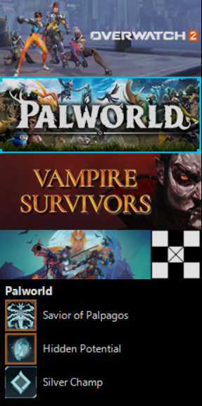
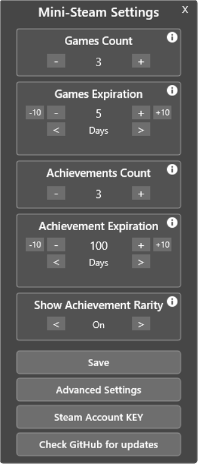
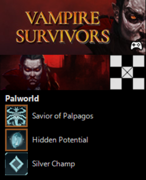
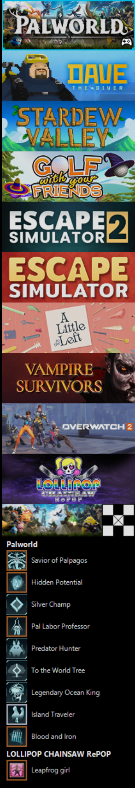

# Advanced Mini-Steam Launcher

Advanced Mini-Steam Launcher displays recent games, recent achievements, and quick links in a configurable compact layout.

Download .rmskin: [Advanced-Mini-Steam-Launcher-1.0.1.rmskin](.git-files/Advanced-Mini-Steam-Launcher-1.0.1.rmskin)

## Screenshots

<table>
  <tr>
    <td style="text-align: center;">
      <strong>3 Games &amp;</strong> 
      <strong>3 Achievements</strong> 
    </td>
    <td style="text-align: center;">
      <strong>Mini-Steam Settings</strong> 
    </td>
    <td style="text-align: center;">
      <strong>1 Game &amp;</strong> 
      <strong>3 Achievements</strong> 
    </td>
    <td style="text-align: center;">
      <strong>10 Games &amp;</strong> 
      <strong>10 Achievements</strong> 
    </td>
  </tr>
  <tr>
    <td style="text-align: center; vertical-align: bottom; width: 20%; height: 455px;">
      
    </td>
    <td style="text-align: center; vertical-align: bottom; width: 20%; height: 455px;">
      
    </td>
    <td style="text-align: center; vertical-align: bottom; width: 20%; height: 455px;">
      
    </td>
    <td style="text-align: center; vertical-align: bottom; width: 20%; height: 455px;">
      
    </td>
  </tr>
</table>

## Features

- Tracks active Steam game and pins it to the top of the list
- Fills remaining slots from recently played games
- Displays up to 10 game banners
- Displays up to 10 recent achievements
- Rare achievements can be displayed with a special border; Gold, Silver, & Bronze
  - Rarity threshold percentages can be adjusted in the Advanced Settings
- Offline mode will retain previous state (no tracking or updates)
- Opens games, game details, Steam library, friends, profile pages, and achievement pages directly from the skin
- Includes a settings menu to make adjusting settings easier

## Requirements

- Windows
- Rainmeter
- Steam
  - Steam Web API key
  - SteamID64
- PowerShell
- Internet connection

Steam privacy and status requirements:

- `My Profile` must be `Public` for achievement tracking
- `Game Details` must be `Public` for achievement tracking
- Steam user status needs to be `Online` for active game detection

## Basic setup

1. Install Rainmeter.
2. Copy the `Advanced Mini-Steam Launcher` folder into `Documents\Rainmeter\Skins\`, or install using the .rmskin.
3. Refresh Rainmeter, then load `\Advanced Mini-Steam-Launcher.ini`.
4. Click the missing credentials message to open `@Resources\SteamAccountInfo.inc`.
5. Open `SteamAccountInfo.inc` and fill in:
   - `SteamAPIKey`
   - `SteamID64`
6. Refresh Rainmeter again.
7. Optional: adjust Settings and `@Resources\AdvancedSettings.inc`.

## Usage

Common actions:
- Game Art
  - Left-click: Launch the game through Steam
  - Right-click: Open the game's Steam library page
- Game Banner
  - Left-click: Open the user's Steam library page
- Profile Image
  - Left-click: Open Steam friends
  - Right-click: Open the user's Steam community profile
- Achievement Panel
  - Left-click: Open the game's achievement page in Steam
- Settings Gear
  - Visible only when hovering over the game banner
  - Left-click: Opens the Mini-Steam Settings menu

## Known issues / limitations

- Rebuild can be slow at times
- Active game tracking and achievement visibility depend entirely on Steam privacy settings.

## Project status

Work in progress / prototype.

## License

Creative Commons Attribution-NonCommercial-ShareAlike 3.0.

## Credits / acknowledgments

- Project authors: IZY2091
- Based on Venelder Mini-Steam Launcher

Check for updates here: 
[Advanced Mini-Steam Launcher on GitHub](https://github.com/RRam2020/Advanced-Mini-Steam-Launcher)

To report issues or request features, use: 
[GitHub Issues](https://github.com/RRam2020/Advanced-Mini-Steam-Launcher/issues).
