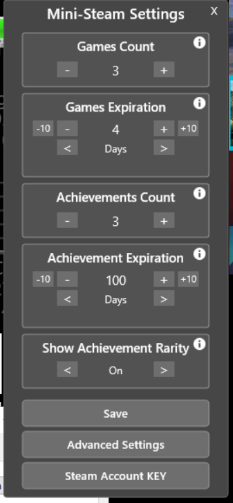

# Advanced Mini-Steam Launcher

Advanced Mini-Steam Launcher is a Windows Rainmeter skin that turns Steam activity into a compact desktop launcher. It exists to give you a fast, always-visible view of your active and recently played games, recent achievements, and key Steam shortcuts without keeping the full Steam client in focus.

It combines live Steam Web API polling, local cache files, and a small Rainmeter settings window to keep the widget responsive while still rebuilding itself automatically when your game state changes.

## Screenshots
- Main launcher view

- Settings window

## Features

- Tracks the currently active Steam game and pins it to the top of the list
- Fills remaining slots from recently played games
- Displays up to 10 game banners with text fallbacks when artwork is missing
- Shows an in-game badge on the top listed game while a game is running
- Polls active game status every 15 seconds
- Polls recent achievements every 60 seconds
- Shows recent achievements with cached icons and optional rarity overlays
- Supports offline fallback by reusing previously cached data and images
- Opens games, game details, Steam library, friends, profile pages, and achievement pages directly from the skin
- Includes a settings sub-skin for game count, expiration windows, achievement count, and achievement rarity

## Requirements

- Windows
- Rainmeter
- Steam desktop client
- PowerShell
- Internet connection for live updates, API calls, and artwork downloads
- A Steam Web API key
- A SteamID64

Steam privacy and status requirements:

- `My Profile` must be `Public` for achievement tracking
- `Game Details` must be `Public` for achievement tracking
- Steam status should be `Online` for active game detection

## Minimal setup

1. Copy the `Advanced Mini-Steam Launcher` folder into `Documents\Rainmeter\Skins\`.
2. Open `@Resources\SteamAccountInfo.inc`.
3. Fill in:
   - `SteamAPIKey`
   - `SteamID64`
4. Optional: adjust `@Resources\AdvancedSettings.inc`.
5. Refresh Rainmeter.
6. Load `Advanced Mini-Steam-Launcher.ini`.

If credentials are missing, the launcher shows a black setup tile that links back to `SteamAccountInfo.inc`.

## Usage

Typical flow:

1. Load the skin in Rainmeter.
2. Launch a Steam game.
3. Within the next polling cycle, that game moves to the top slot and shows the in-game badge.
4. Close the game and the launcher will reorder itself when the active game clears or when the configured expiration window is reached.

Common actions:

- Left-click a game banner: launch or switch to that game in Steam
- Right-click a game banner: open that game's Steam details page
- Left-click the bottom Steam banner: open the Steam games/library area
- Left-click the profile image: open Steam friends
- Right-click the profile image: open the Steam community profile
- Left-click an achievement panel: open that game's achievement page in Steam
- Use the gear on the bottom banner or the Rainmeter context menu to open Settings
- Use `Rebuild` from the Rainmeter context menu to force a manual refresh

## Known issues / limitations

- First load after clearing `@Resources\Cache` can take longer because the launcher must rebuild data files, banners, and achievement assets
- Achievement visibility depends on Steam API availability and Steam privacy settings
- Active game tracking depends on Steam reporting an online in-game state
- No screenshots are bundled yet in this repository

## Project status

Work in progress / prototype.

The launcher is usable, but the project is still being iterated on and the structure may continue to change.

## License

Creative Commons Attribution-NonCommercial-ShareAlike 3.0.

If you plan to publish or redistribute the project, verify that this is still the intended license for the repository.

## Credits / acknowledgments

- Project authors: IZY2091 / Venelder
- Built on Rainmeter
- Uses the Steam Web API and Steam-hosted artwork/assets where available
